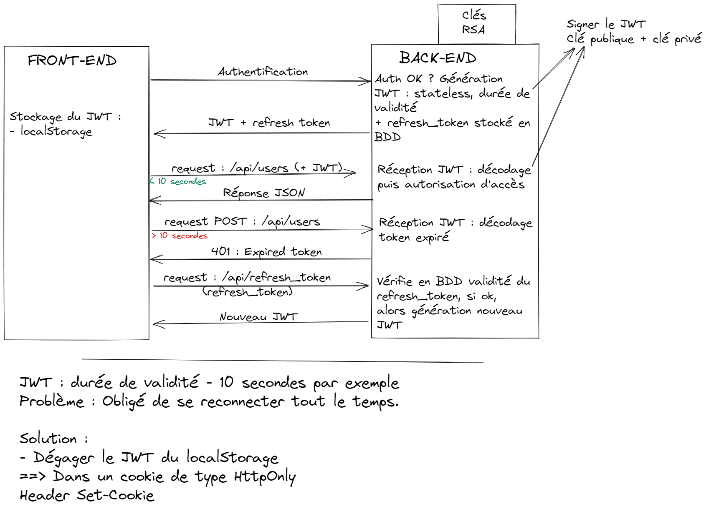

# Authentification avec NextJS, Axios et NodeJS / ExpressJS

## 1 - Schéma du système d'authentification



## 2 - Connexion

Au travers d'un formulaire de login basique, on envoie les informations de connexion à notre serveur via une requête POST avec [Axios](https://axios-http.com/fr/docs/intro). On aura besoin de configurer un fichier `axiosconfig.js`, comme ci-dessous, qui devra être utilisé pour toutes les requêtes de l'application (Ainsi, dans vos fichiers au lieu d'importer axios pour faire des requêtes, importer votre fichier axiosconfig.js).

> front/axiosconfig.js

```javascript
import axios from "axios";

// On va créer une instance d'axios avec des paramètres par défaut
const instance = axios.create({
  // Permet d'ajouter les cookies à chaque requête
  withCredentials: true,
  // Permet d'indiquer directement la route sans l'URL à chaque requête
  baseURL: "votreurl",
});

export default instance;
```

À noter que sur le serveur, les credentials doivent également être activés, avec ExpressJS en Typescript, on le fait de cette manière :

> server/index.ts

```javascript
import express, {Express}  from 'express';
import cors from 'cors';
import dotenv from 'dotenv';
import cookieParser from "cookie-parser";

// Permet d'utiliser le .env
dotenv.config();

const app: Express = express();

// Permet de manipuler les cookies
app.use(cookieParser());

app.use(express.json());
app.use(cors({
    origin: [process.env.ORIGIN as string],
    methods: ["GET","POST", "DELETE", "PUT"],
    credentials: true // Permet de recevoir les cookies
}));
```

Sur notre serveur, on crée une route login pour vérifier la connexion.

> server/routes/auth.ts

```javascript
router.post("/login", (req: Request, res: Response) => {
  //...
});
```

Dans cette route, nous allons :

- Récupérer les informations de connexions depuis le body de la requête
- Vérifier que l'utilisateur existe
- Éventuellement vérifier si le mot de passe correspond au mot de passe crypté en base
- Générer un access token (Avec la librairie [jsonwebtoken](https://github.com/auth0/node-jsonwebtoken#readme)) avec les données utilisateurs en enlevant le mot de passe et le refresh token
- Générer un refresh token avec un secret différent
- Modifier l'utilisateur en ajoutant son refresh token en base
- Envoyer une réponse de succès avec un cookie httpOnly pour chaque token, et l'user dans le corps de la réponse

Retrouvez [ici](https://github.com/ynov-b3-dev-web/projet-web-oui/blob/dev/server/routes/auth.ts) l'ensemble du code commenté et détaillé.

Une fois la connexion réussie, ses données vont être conservées et l'utilisateur sera redirigé dans la page d'accueil.

## 3 - Conservation des données utilisateurs

Les données utilisateurs sont conservées dans un [contexte de React](https://reactjs.org/docs/context.html). Le contexte permet d'avoir un état global à l'application, pour pouvoir les mettre à jour et les utiliser dès que nécessaire.

### Reducer

La méthode `reduce` permet d'accumuler des valeurs ([Voir mdn](https://developer.mozilla.org/fr/docs/Web/JavaScript/Reference/Global_Objects/Array/Reduce)). Un `Reducer` est une fonction qui va permettre de conserver un état et de performer des actions dessus ([Voir redux](https://redux.js.org/tutorials/fundamentals/part-2-concepts-data-flow#reducers)). En React, on va utiliser le hook [useReducer](https://fr.reactjs.org/docs/hooks-reference.html#usereducer) contenant le `state` de notre application, et une fonction `dispatch` qui nous permettra de performer des actions définie par la suite, que l'on va intégrer à notre contexte. Tout d'abord, on va définir un état initial.

```javascript
export const initialState = {
  user: null,
  loading: false,
  errorMessage: null,
};
```

Puis on va définir les actions que pourra réaliser notre reducer. Il doit retourner un objet qui sera le nouvel état.

> front/context/Auth/AuthReducer.js

```javascript
export const AuthReducer = (state, action) => {
  switch (action.type) {
    case 'ACTION 1':
      // On utilise le spread operator (...) pour récupérer l'état précédent, et on y ajoute ou modifie uniquement ce que l'on souhaite
      return {
        ...state,
        variable : "nouvelle valeur",
      };
    case 'ACTION 2':
      return {
        ...state
      };
    ...
    default:
      throw new Error(`Unhandled action type: ${action.type}`);
  }
};
```

Voir le code complet [ici](https://github.com/ynov-b3-dev-web/projet-web-oui/blob/dev/front/context/Auth/AuthReducer.js).

### Contexte

On crée le contexte.

```javascript
const AuthStateContext = createContext();
```

On crée la fonction qui permettra de récupérer les données du contexte avec le hook [useContext](https://fr.reactjs.org/docs/hooks-reference.html#usecontext).

```javascript
export const useAuthState = () => useContext(AuthStateContext);
```

Le provider doit englober l'application (ou la partie qui nécessite l'authentification) et permet l'utilisation du contexte pour tous ses composants enfants. On lui passe en valeur le hook useReducer, avec le Reducer que l'on a définit précédemment, ainsi que l'état initial.

```javascript
export const AuthProvider = ({ children }) => (
  // On passe le reducer avec son état initial au provider
  <AuthStateContext.Provider value={useReducer(AuthReducer, initialState)}>
    {children}
  </AuthStateContext.Provider>
);
```

On ajoute le Provider au niveau souhaité, soit dans NextJS dans le fichier `front/pages/_app.js`.

```javascript
import { AuthProvider } from "@/context/Auth/";

function MyApp({ Component, pageProps }) {
  return (
    <AuthProvider>
      <Component {...pageProps} />
    </AuthProvider>
  );
}
```

Nous allons par la suite pouvoir utiliser les données du contexte de plusieurs manières :

```javascript
const [state, dispatch] = useAuthState(); // Pour tout récupérer
const [{ user }, dispatch] = useAuthState(); // Pour récupérer uniquement la variable user du state
const [, dispatch] = useAuthState(); // Pour récupérer que le dispatch
const [state] = useAuthState(); // Pour récupérer que le state
```

### Sauvegarde après login

Après le login, quand le serveur nous renvoie un succès, la réponse est accompagnée de données utilisateurs qui vont être sauvegardée dans le contexte via la fonction `dispatch`.

> front/context/Auth/AuthAction.js

```javascript
export async function login(dispatch, payload) {
  try {
    dispatch({ type: "REQUEST_LOGIN" });
    const res = await axios.post(
      `${process.env.NEXT_PUBLIC_SERVER_URL}/auth/login`,
      payload
    );
    if (res.data.user) {
      dispatch({ type: "LOGIN_SUCCESS", payload: res.data });
      return res.data.user;
    }

    dispatch({ type: "LOGIN_ERROR", error: res.data.message });
    return;
  } catch (err) {
    dispatch({ type: "LOGIN_ERROR", error: err.response.data.message });
  }
}
```

### Protected Route

Le contexte en React, ne sauvegarde pas l'état dans le cas où l'utilisateur rafraichit la page. Par conséquent, les données utilisateurs à ce moment là sont réinitialisées. Pour pallier à ça, nous pouvons englober les pages nécessitants l'authentification d'un composant `ProtectedRoute`, qui requêtera une route du serveur pour vérifier si l'utilisateur est authentifié, et nous retournera les données.

Côté serveur, on a la route `/isAuth` qui renvoie l'user donné par le middleware `authorization`. Un middleware est une fonction qui va être exécutée en amont, et permettra de passer à la suite au moment ou l'on souhaite avec la fonction `next()`;

> server/routes/auth.ts

```javascript
router.get("/isAuth", authorization, (req: any, res: any) => {
  return res.json({ user: req.user });
});
```

> server/middleware/authorization.ts

```javascript
const jwt = require('jsonwebtoken');

const authorization = (req: any, res: any, next: any) => {
  const token = req.cookies.access_token;
  try {
    if (!token) {
      return res.status(401).json({success: false,message:"Not connected"});
    }

      // On vérifie si le token est correct
      jwt.verify(token, process.env.AUTH_SECRET_TOKEN, (err: any, result: any) => {
        // Si il y a une erreur, on renvoie un 401
        if(err){
          return res.status(401).json({success:false, ...err})
        }

        // Si il n y a pas d'erreur, on met les données utilisateurs dans une variable et on entre dans la route demandée
        req.user=result;
        return next();
      });
    } catch(err: any) {
      return res.status(500).json({success: false,message:"Une erreur est survenue"});
    }
}

export default authorization;
```

Côté front, on définit notre `ProtectedRoute`, en récupérant le props `children` qui contient tous les enfants du composant. On va ensuite récupérer la variable `user` et `loading` de notre contexte, ainsi que la fonction dispatch pour effectuer des actions avec le reducer.
Si l'user est à null ou si une requête est en cours, on peut afficher un écran de chargement, et dans le cas contraire, on affiche les enfants de notre route, soit le contenu de la page. On va également utiliser le hook NextJS [useRouter](https://nextjs.org/docs/api-reference/next/router), qui nous permettra d'effectuer des redirections. Dans le cas de React, il faudra utiliser une alternative comme le hook [useNavigate](https://reactrouter.com/docs/en/v6/hooks/use-navigate) de React-router. :

> front/context/Auth/ProtectedRoute.js

```javascript
import axios from "axiosconfig";
import { useRouter } from "next/router";
import React, { useEffect } from "react";
import { useAuthState } from "./AuthContext";

const ProtectedRoute = ({ children }) => {
  const [{ user, loading }, dispatch] = useAuthState();
  const router = useRouter();
  // ...
  if (user === null || loading) {
    return <div className="spinner">Loading ... </div>;
  }

  return children;
};

export default ProtectedRoute;
```

On ajoute un [useEffect](https://fr.reactjs.org/docs/hooks-reference.html#useeffect) à notre ProtectedRoute qui va s'exécuter dès le chargement de la page et requêter la route `/isAuth`.

```javascript
// Le hook useEffect va s'éxecuter dès le chargement de la page
useEffect(() => {
  // Cette action va mettre la variable loading à true
  dispatch({ type: "REQUEST_LOGIN" });

  // On définit une fonction qui renvoie true si l'utilisateur est authentifié
  const isAuth = async () => {
    try {
      const res = await axios.get("/auth/isAuth");
      if (res && res.data) {
        dispatch({ type: "LOGIN_SUCCESS", payload: res.data });
        return true;
      }
    } catch (error) {
      dispatch({ type: "LOGIN_ERROR", error: error.response.data.message });
      return false;
    }
  };

  // On appelle la fonction isAuth, si la variable response est à false, on redirige vers la page login
  isAuth().then((response) => {
    !response && router.push("/login");
  });
}, []);
```

## 4 - Gestion du rafraichissement de JWT

Dans le cas d'un access token qui expire, on va utiliser les [Axios interceptors](https://axios-http.com/docs/interceptors) dans le fichier `axiosconfig.js` pour rafraichir notre token. Le premier paramètre de la fonction `use()` permet de définir un intercepteur si la requête est un succès, que l'on va laisser vide dans notre exemple, et le deuxième paramètre permet de définir un intercepteur en cas d'erreur, ce qui nous intéresse ici.

> front/axiosconfig.js

```javascript
instance.interceptors.response.use({}, (error) => {
  // On récupère le corps de la réponse ainsi que la requête effectuée
  const data = error.response.data;
  const originalRequest = error.config;
  // Si l'erreur est un 401 et indique que le token est expiré
  if (
    error.response.status === 401 &&
    data.name.toLowerCase().includes("expire")
  ) {
    // On effectue une requête à la route qui rafraichit le token
    return axios
      .get(`${process.env.NEXT_PUBLIC_SERVER_URL}/auth/refreshToken`, {
        withCredentials: true,
      })
      .then((res) => {
        // Si la requête est un succès, on retente la requête de base effectuée
        if (res.status === 201) {
          return axios(originalRequest);
        }
      });
  }

  // Renvoie toutes les autres erreurs
  return Promise.reject(error);
});
```

Sur notre serveur, on crée une route pour rafraichir notre token.

> server/routes/auth.ts

```javascript
router.get("/refreshToken", (req: Request, res: Response) => {
  // ...
});
```

Dans cette route, nous allons :
- Vérifier que le token fourni n'est pas vide
- Vérifier que le token est valide
- Vérifier que l'user correspondant au token existe, et que le token fourni est similaire à celui en base
- Générer un nouveau token
- Envoyez une réponse de succès avec un cookie httpOnly pour le nouvel access token

Voir le code complet [ici](https://github.com/ynov-b3-dev-web/projet-web-oui/blob/dev/server/routes/auth.ts)